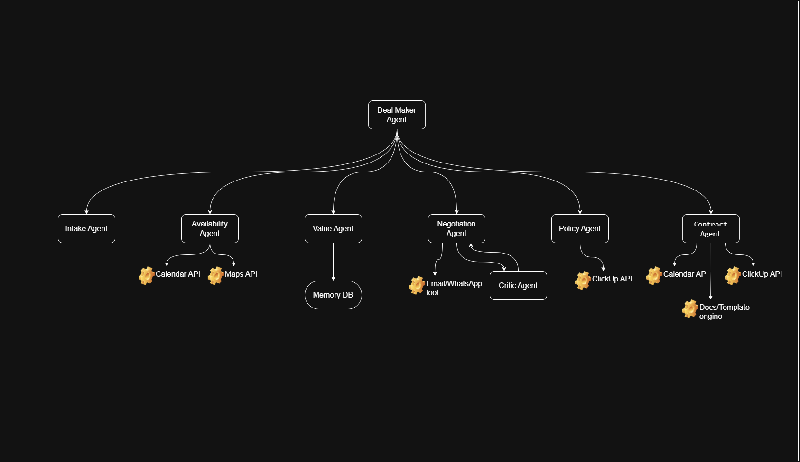

# 🤖 Dealmaker Agent — Autonomous Client Negotiation System for Solopreneurs

Dealmaker Agent is an **autonomous multi-agent system** that negotiates with clients, manages pricing, checks availability, handles approvals, and finalizes contracts **end-to-end** for solopreneurs and small service businesses.

This project was developed as part of the **Google ADK Agent Hackathon** and aims to demonstrate:

- Multi-agent architecture  
- Tools usage (Calendar, ClickUp, Email/WhatsApp, Docs engine)
- Sessions & Memory  
- Observability  
- Human-in-the-loop approvals  
- State management and multi-step reasoning  
- Loop-based negotiation patterns  

---

## ✨ Why This Project

Solopreneurs often spend hours chatting with leads:
- discussing requirements
- checking calendar availability manually
- negotiating price repeatedly
- sending confirmations
- and trying not to lose deals due to slow replies.

Meanwhile, real client work is waiting.

Dealmaker automates the entire negotiation lifecycle, reducing manual back-and-forth and increasing conversions while allowing human control where needed.

---

## 📌 Problem Being Solved

Small business owners struggle with:

- inconsistent negotiation messaging  
- difficulty deciding pricing  
- delayed responses leading to lost clients  
- juggling multiple conversations  
- manually creating contracts & invoices  
- no unified system that can negotiate **on behalf of the business**

Most CRM tools store leads.  
None negotiates.

---

## 🚀 What Dealmaker Does

Given a simple incoming message, Dealmaker:

1. Parses the lead
2. Checks calendar availability
3. Creates tentative holds
4. Retrieves past deal memory
5. Negotiates via email/WhatsApp
6. Simulates negotiation options
7. Escalates decisions only if needed
8. Finalizes the contract
9. Confirms calendar & invoice

Human steps in only when required by policy.

---

## 🧠 Key Innovation

### 🔹 Multi-agent Workflow

| Sub-Agent | Purpose |
|---|---|
| Intake Agent | Lead extraction |
| Availability Agent | Calendar + alternatives |
| Value Agent | Price logic & memory |
| Negotiation Agent | Messaging | 
| Critic Agent | Simulation & scoring |
| Policy Agent | Human approval logic |
| Contract Agent | Finalization & docs |

This architecture enables:
- autonomy
- safety (HITL approvals)
- memory-based reasoning
- state persistence

---

## 🕸 Architecture

### Architecture Diagram



---

## 🧱 Architecture Summary

The orchestration starts from the **Dealmaker Agent**, which manages the entire lifecycle by sequentially and repeatedly invoking the following dedicated agents:

- **Intake Agent**  
  Extracts structured details from raw client inquiries (dates, budget, location, services).

- **Availability Agent**  
  Checks calendar availability, proposes alternative dates if needed, and creates tentative holds using calendar tools.

- **Value Agent**  
  Fetches historical data and pricing memory to compute minimum acceptable price, target price, and red-lines.

- **Negotiation Agent**  
  Communicates with the client using email or WhatsApp tools, producing offers and counter-offers.

- **Critic Agent**  
  Simulates negotiation outcomes, scores options, and helps guide negotiation strategies toward better outcomes.

- **Policy Agent**  
  Enforces red-line rules and triggers human-in-the-loop approvals (for example by creating a ClickUp approval task).

- **Contract Agent**  
  Creates a final contract text and confirms calendar bookings once a negotiation is finalized.

External tools and services such as Calendar APIs, ClickUp, email/WhatsApp tools, and a document template engine are integrated at each corresponding step based on which agent is operating.  

---

## 📦 Setup

### 1. Clone
```bash
git clone https://github.com/ArulVirumbi/DealMakerAgent
cd dealmaker-agent
```


### 2. Install dependencies
```bash
pip install -r requirements.txt
```


### 3. Environment variables

Copy `.env.example` → `.env` and fill in credentials:
```bash
GOOGLE_ADK_API_KEY=
CLICKUP_API_KEY=
AUTO_TENTATIVE=true
```

### 4. Start the service
```bash
uvicorn app.app:app --reload
```

---

## 🧪 Demo Usage

### 1. Submit a lead
```bash
POST /lead
{
"lead_text": "Hi, we need a photographer for Feb 10..."
}
```

### 2. Simulate client reply
```bash
POST /webhook/reply
{
"session_id":"<returned_id>",
"reply_text":"Can you reduce the price?"
}
```


### 3. (Optional) Human approval
```bash
POST /clickup/webhook
{
"approval_id": "...",
"decision": "APPROVED"
}
```

---

## 👀 Human-in-the-Loop Safety

Whenever a pricing concession crosses a red-line or involves sensitive negotiation logic, the Policy Agent triggers a human approval event (for example through ClickUp).  
The negotiation resumes automatically after the approval or rejection.

---

## 🧭 Observability

The system includes logging and tracing hooks which make it easier to inspect agent behaviors, debug negotiations, evaluate negotiation strategies, and maintain transparent audit trails.  
These logs can be extended with OpenTelemetry exporters in production deployments.

---

## 🔮 Future Improvements

- real Google Calendar integration  
- vector database for long-term memory retrieval  
- end-to-end ClickUp/WhatsApp automation  
- browser-based negotiation dashboard  
- contract templates per service category  

---

## 🏁 Summary

Dealmaker is a practical and extensible autonomous negotiation system demonstrating multi-agent orchestration, memory, agent-to-agent communication, tool integrations, and human-in-the-loop safety.  
It significantly reduces manual negotiation workload, improves consistency, and increases booking conversion for solopreneurs.

---
